# Design Document: Authentication UX Improvements

## Overview

This design document specifies the technical implementation for 10 UX improvements to the authentication system in the "Dłużnik" debt management application. The improvements enhance usability, security, and accessibility of the login and registration flows.

### Feature Scope

The feature encompasses:

1. **Show/Hide Password Toggle** - Visual password visibility control
2. **Real-Time Password Validation** - Live password strength feedback
3. **Remember Me Checkbox** - Extended session management
4. **Forgot Password Flow** - Email-based password reset
5. **Better Autocomplete and Autofocus** - Browser integration improvements
6. **Real-Time Email Validation** - Live email format checking with typo detection
7. **Social Login (OAuth)** - Third-party authentication (Google, Facebook, Apple)
8. **Better Error Messages** - User-friendly error communication
9. **Registration Progress Bar** - Visual registration flow indicator
10. **Biometric Authentication** - WebAuthn-based biometric login

### Technology Stack

- **Frontend**: React 18+ with TypeScript, functional components with hooks
- **Backend**: Node.js with Express, TypeScript
- **Authentication**: JWT tokens, bcrypt for password hashing
- **OAuth**: Passport.js with provider-specific strategies
- **Biometric**: WebAuthn API (@simplewebauthn/server, @simplewebauthn/browser)
- **Email**: Nodemailer for password reset emails
- **Validation**: Zod for schema validation, custom validators for real-time feedback

### Design Principles

- **Progressive Enhancement**: Features degrade gracefully when browser APIs are unavailable
- **Accessibility First**: WCAG 2.1 AA compliance with keyboard navigation and screen reader support
- **Security by Default**: Rate limiting, token expiration, secure credential storage
- **Mobile Responsive**: Touch-friendly UI with appropriate input types
- **Performance**: Debounced validation, optimistic UI updates, minimal re-renders


## Architecture

### System Architecture

```mermaid
graph TB
    subgraph "Frontend - React"
        LoginPage[LoginPage Component]
        RegisterPage[RegisterPage Component]
        PasswordInput[PasswordInput Component]
        EmailInput[EmailInput Component]
        ProgressBar[ProgressBar Component]
        OAuthButtons[OAuthButtons Component]
        BiometricButton[BiometricButton Component]
        
        LoginPage --> PasswordInput
        LoginPage --> EmailInput
        LoginPage --> OAuthButtons
        LoginPage --> BiometricButton
        
        RegisterPage --> PasswordInput
        RegisterPage --> EmailInput
        RegisterPage --> ProgressBar
    end
    
    subgraph "Frontend - Hooks & Utils"
        usePasswordValidation[usePasswordValidation Hook]
        useEmailValidation[useEmailValidation Hook]
        useBiometric[useBiometric Hook]
        ErrorFormatter[ErrorFormatter Utility]
        
        PasswordInput --> usePasswordValidation
        EmailInput --> useEmailValidation
        BiometricButton --> useBiometric
    end
    
    subgraph "Backend - Express API"
        AuthRoutes[Auth Routes]
        OAuthRoutes[OAuth Routes]
        PasswordResetRoutes[Password Reset Routes]
        BiometricRoutes[Biometric Routes]
        
        AuthController[Auth Controller]
        OAuthController[OAuth Controller]
        PasswordResetController[Password Reset Controller]
        BiometricController[Biometric Controller]
        
        AuthRoutes --> AuthController
        OAuthRoutes --> OAuthController
        PasswordResetRoutes --> PasswordResetController
        BiometricRoutes --> BiometricController
    end
    
    subgraph "Backend - Services"
        AuthService[Auth Service]
        TokenService[Token Service]
        EmailService[Email Service]
        OAuthService[OAuth Service]
        BiometricService[Biometric Service]
        RateLimitService[Rate Limit Service]
        
        AuthController --> AuthService
        AuthController --> TokenService
        PasswordResetController --> EmailService
        PasswordResetController --> RateLimitService
        OAuthController --> OAuthService
        BiometricController --> BiometricService
    end
    
    subgraph "External Services"
        GoogleOAuth[Google OAuth]
        FacebookOAuth[Facebook OAuth]
        AppleOAuth[Apple OAuth]
        EmailProvider[Email Provider - SMTP]
        
        OAuthService --> GoogleOAuth
        OAuthService --> FacebookOAuth
        OAuthService --> AppleOAuth
        EmailService --> EmailProvider
    end
    
    subgraph "Database"
        UsersTable[(Users Table)]
        ResetTokensTable[(Reset Tokens Table)]
        BiometricCredsTable[(Biometric Credentials Table)]
        RateLimitTable[(Rate Limit Table)]
        
        AuthService --> UsersTable
        PasswordResetController --> ResetTokensTable
        BiometricService --> BiometricCredsTable
        RateLimitService --> RateLimitTable
    end
    
    LoginPage -.HTTP.-> AuthRoutes
    LoginPage -.HTTP.-> OAuthRoutes
    LoginPage -.HTTP.-> BiometricRoutes
    RegisterPage -.HTTP.-> AuthRoutes
```




### Component Architecture

#### Frontend Components

**PasswordInput Component**
- Renders password field with toggle button
- Manages visibility state (masked/visible)
- Integrates with usePasswordValidation hook
- Provides accessibility attributes (aria-label, role)
- Keyboard navigable (Tab, Enter, Space)

**EmailInput Component**
- Renders email field with validation feedback
- Integrates with useEmailValidation hook
- Displays typo suggestions
- Shows validation icons (checkmark, error)
- Debounces validation to reduce re-renders

**ProgressBar Component**
- Displays 3-step registration progress
- Highlights active step
- Shows completed steps with checkmarks
- Responsive layout (horizontal/vertical)
- Prevents navigation to incomplete steps

**OAuthButtons Component**
- Renders provider-specific buttons (Google, Facebook, Apple)
- Handles OAuth redirect flow
- Displays loading states
- Error handling with user-friendly messages

**BiometricButton Component**
- Conditionally renders based on WebAuthn support
- Handles registration and authentication flows
- Displays native biometric prompts
- Manages credential storage

#### Custom Hooks

**usePasswordValidation**
```typescript
interface PasswordValidation {
  strength: 'weak' | 'medium' | 'strong';
  requirements: {
    minLength: boolean;
    hasUppercase: boolean;
    hasLowercase: boolean;
    hasNumber: boolean;
    hasSpecial: boolean;
  };
  score: number; // 0-100
  isValid: boolean;
}

function usePasswordValidation(password: string): PasswordValidation
```

**useEmailValidation**
```typescript
interface EmailValidation {
  isValid: boolean;
  error: string | null;
  suggestion: string | null;
  onAcceptSuggestion: () => void;
}

function useEmailValidation(email: string): EmailValidation
```

**useBiometric**
```typescript
interface BiometricAuth {
  isSupported: boolean;
  isRegistered: boolean;
  register: () => Promise<void>;
  authenticate: () => Promise<{ token: string; user: User }>;
  error: string | null;
  loading: boolean;
}

function useBiometric(): BiometricAuth
```


## Components and Interfaces

### Frontend Components

#### 1. PasswordInput Component

**Props Interface**
```typescript
interface PasswordInputProps {
  value: string;
  onChange: (value: string) => void;
  label: string;
  placeholder?: string;
  autoComplete?: 'current-password' | 'new-password';
  showValidation?: boolean; // For registration
  required?: boolean;
  disabled?: boolean;
  error?: string;
}
```

**State Management**
- `isVisible: boolean` - Controls password visibility
- `validation: PasswordValidation` - From usePasswordValidation hook

**Key Methods**
- `toggleVisibility()` - Switches between text/password input type
- `handleKeyDown(e: KeyboardEvent)` - Handles Enter/Space on toggle button

#### 2. EmailInput Component

**Props Interface**
```typescript
interface EmailInputProps {
  value: string;
  onChange: (value: string) => void;
  label: string;
  placeholder?: string;
  autoComplete?: 'email' | 'username';
  required?: boolean;
  disabled?: boolean;
  error?: string;
}
```

**State Management**
- `validation: EmailValidation` - From useEmailValidation hook
- `debouncedValue: string` - Debounced email for validation

#### 3. ProgressBar Component

**Props Interface**
```typescript
interface ProgressBarProps {
  currentStep: 1 | 2 | 3;
  steps: Array<{
    id: number;
    label: string;
    completed: boolean;
  }>;
  onStepClick?: (step: number) => void;
}
```

#### 4. OAuthButtons Component

**Props Interface**
```typescript
interface OAuthButtonsProps {
  onSuccess: (token: string, user: User) => void;
  onError: (error: string) => void;
  disabled?: boolean;
}
```

**Supported Providers**
```typescript
type OAuthProvider = 'google' | 'facebook' | 'apple';

interface OAuthConfig {
  provider: OAuthProvider;
  label: string;
  icon: string;
  color: string;
  authUrl: string;
}
```

#### 5. BiometricButton Component

**Props Interface**
```typescript
interface BiometricButtonProps {
  mode: 'register' | 'authenticate';
  onSuccess: (token: string, user: User) => void;
  onError: (error: string) => void;
  disabled?: boolean;
}
```


### Backend API Endpoints

#### Authentication Endpoints (Extended)

**POST /api/auth/login**
```typescript
// Request
interface LoginRequest {
  email: string;
  password: string;
  rememberMe?: boolean; // New field
}

// Response
interface LoginResponse {
  user: User;
  token: string;
  expiresIn: number; // 24h or 30d based on rememberMe
}
```

**POST /api/auth/register**
```typescript
// Request (unchanged)
interface RegisterRequest {
  email: string;
  password: string;
  confirmPassword: string;
}

// Response
interface RegisterResponse {
  user: User;
  message: string;
}
```

#### Password Reset Endpoints (New)

**POST /api/auth/forgot-password**
```typescript
// Request
interface ForgotPasswordRequest {
  email: string;
}

// Response
interface ForgotPasswordResponse {
  message: string; // Generic message to prevent email enumeration
}
```

**POST /api/auth/reset-password**
```typescript
// Request
interface ResetPasswordRequest {
  token: string;
  newPassword: string;
}

// Response
interface ResetPasswordResponse {
  message: string;
}
```

**GET /api/auth/verify-reset-token/:token**
```typescript
// Response
interface VerifyResetTokenResponse {
  valid: boolean;
  email?: string; // Only if valid
}
```

#### OAuth Endpoints (New)

**GET /api/auth/oauth/:provider**
- Redirects to OAuth provider authorization page
- Providers: google, facebook, apple

**GET /api/auth/oauth/:provider/callback**
```typescript
// Query params from OAuth provider
interface OAuthCallbackQuery {
  code: string;
  state: string;
}

// Response (redirect to frontend with token)
// Success: /login?token=<jwt>&success=true
// Error: /login?error=<message>
```

#### Biometric Endpoints (New)

**POST /api/auth/biometric/register-options**
```typescript
// Request
interface BiometricRegisterOptionsRequest {
  userId: string;
}

// Response (WebAuthn PublicKeyCredentialCreationOptions)
interface BiometricRegisterOptionsResponse {
  challenge: string;
  rp: { name: string; id: string };
  user: { id: string; name: string; displayName: string };
  pubKeyCredParams: Array<{ type: string; alg: number }>;
  timeout: number;
  authenticatorSelection: {
    authenticatorAttachment: 'platform';
    userVerification: 'required';
  };
}
```

**POST /api/auth/biometric/register-verify**
```typescript
// Request (WebAuthn credential response)
interface BiometricRegisterVerifyRequest {
  userId: string;
  credential: PublicKeyCredential;
  credentialName?: string;
}

// Response
interface BiometricRegisterVerifyResponse {
  success: boolean;
  credentialId: string;
}
```

**POST /api/auth/biometric/authenticate-options**
```typescript
// Request
interface BiometricAuthOptionsRequest {
  email?: string; // Optional, can use stored credentials
}

// Response (WebAuthn PublicKeyCredentialRequestOptions)
interface BiometricAuthOptionsResponse {
  challenge: string;
  timeout: number;
  rpId: string;
  allowCredentials: Array<{ type: string; id: string }>;
  userVerification: 'required';
}
```

**POST /api/auth/biometric/authenticate-verify**
```typescript
// Request
interface BiometricAuthVerifyRequest {
  credential: PublicKeyCredential;
}

// Response
interface BiometricAuthVerifyResponse {
  user: User;
  token: string;
  expiresIn: number;
}
```

**GET /api/auth/biometric/credentials**
```typescript
// Response
interface BiometricCredentialsResponse {
  credentials: Array<{
    id: string;
    name: string;
    createdAt: string;
    lastUsed: string | null;
  }>;
}
```

**DELETE /api/auth/biometric/credentials/:id**
```typescript
// Response
interface DeleteBiometricCredentialResponse {
  success: boolean;
  message: string;
}
```


## Data Models

### Database Schema Extensions

#### Users Table (Extended)
```sql
ALTER TABLE users ADD COLUMN oauth_provider VARCHAR(50);
ALTER TABLE users ADD COLUMN oauth_provider_id VARCHAR(255);
ALTER TABLE users ADD COLUMN profile_picture_url TEXT;
ALTER TABLE users ADD COLUMN last_login_method VARCHAR(50); -- 'password', 'oauth', 'biometric'
ALTER TABLE users ADD COLUMN last_login_at TIMESTAMP;

CREATE INDEX idx_users_oauth ON users(oauth_provider, oauth_provider_id);
```

#### Password Reset Tokens Table (New)
```sql
CREATE TABLE password_reset_tokens (
  id UUID PRIMARY KEY DEFAULT gen_random_uuid(),
  user_id UUID NOT NULL REFERENCES users(id) ON DELETE CASCADE,
  token VARCHAR(255) NOT NULL UNIQUE,
  expires_at TIMESTAMP NOT NULL,
  used_at TIMESTAMP,
  created_at TIMESTAMP DEFAULT NOW(),
  
  INDEX idx_token (token),
  INDEX idx_user_id (user_id),
  INDEX idx_expires_at (expires_at)
);
```

#### Biometric Credentials Table (New)
```sql
CREATE TABLE biometric_credentials (
  id UUID PRIMARY KEY DEFAULT gen_random_uuid(),
  user_id UUID NOT NULL REFERENCES users(id) ON DELETE CASCADE,
  credential_id TEXT NOT NULL UNIQUE,
  public_key TEXT NOT NULL,
  counter BIGINT NOT NULL DEFAULT 0,
  credential_name VARCHAR(255),
  transports TEXT[], -- ['internal', 'usb', 'nfc', 'ble']
  last_used_at TIMESTAMP,
  created_at TIMESTAMP DEFAULT NOW(),
  
  INDEX idx_user_id (user_id),
  INDEX idx_credential_id (credential_id)
);
```

#### Rate Limit Table (Extended)
```sql
CREATE TABLE rate_limits (
  id UUID PRIMARY KEY DEFAULT gen_random_uuid(),
  identifier VARCHAR(255) NOT NULL, -- email or IP
  action VARCHAR(50) NOT NULL, -- 'password_reset', 'login_attempt', 'biometric_register'
  attempts INT NOT NULL DEFAULT 1,
  window_start TIMESTAMP NOT NULL,
  created_at TIMESTAMP DEFAULT NOW(),
  
  UNIQUE(identifier, action),
  INDEX idx_identifier_action (identifier, action),
  INDEX idx_window_start (window_start)
);
```

### TypeScript Interfaces

#### User Model (Extended)
```typescript
interface User {
  id: string;
  email: string;
  password?: string; // Optional for OAuth users
  emailVerified: boolean;
  notificationsEnabled: boolean;
  oauthProvider?: 'google' | 'facebook' | 'apple';
  oauthProviderId?: string;
  profilePictureUrl?: string;
  lastLoginMethod?: 'password' | 'oauth' | 'biometric';
  lastLoginAt?: Date;
  createdAt: Date;
  updatedAt: Date;
}
```

#### Password Reset Token Model
```typescript
interface PasswordResetToken {
  id: string;
  userId: string;
  token: string;
  expiresAt: Date;
  usedAt?: Date;
  createdAt: Date;
}
```

#### Biometric Credential Model
```typescript
interface BiometricCredential {
  id: string;
  userId: string;
  credentialId: string; // Base64 encoded
  publicKey: string; // Base64 encoded
  counter: number;
  credentialName?: string;
  transports?: AuthenticatorTransport[];
  lastUsedAt?: Date;
  createdAt: Date;
}
```

#### Rate Limit Model
```typescript
interface RateLimit {
  id: string;
  identifier: string;
  action: 'password_reset' | 'login_attempt' | 'biometric_register';
  attempts: number;
  windowStart: Date;
  createdAt: Date;
}
```


## Error Handling

### Frontend Error Handling

#### Error Message Mapping
```typescript
const ERROR_MESSAGES: Record<string, string> = {
  // Authentication errors
  'INVALID_CREDENTIALS': 'Email lub hasło jest nieprawidłowe',
  'EMAIL_ALREADY_EXISTS': 'Ten adres email jest już zarejestrowany. Spróbuj się zalogować lub użyj opcji "Zapomniałeś hasła?"',
  'WEAK_PASSWORD': 'Hasło musi spełniać wszystkie wymagania bezpieczeństwa',
  'PASSWORDS_MISMATCH': 'Hasła nie są identyczne',
  'MISSING_FIELDS': 'Wszystkie pola są wymagane',
  
  // Network errors
  'NETWORK_ERROR': 'Nie można połączyć z serwerem. Sprawdź połączenie internetowe i spróbuj ponownie',
  'SERVER_ERROR': 'Wystąpił błąd serwera. Spróbuj ponownie za chwilę',
  
  // Rate limiting
  'RATE_LIMIT_EXCEEDED': 'Zbyt wiele prób. Spróbuj ponownie za {minutes} minut',
  
  // Password reset
  'INVALID_EMAIL_FORMAT': 'Nieprawidłowy format email',
  'RESET_TOKEN_INVALID': 'Link resetowania hasła jest nieprawidłowy lub wygasł',
  'RESET_TOKEN_EXPIRED': 'Link resetowania hasła wygasł. Poproś o nowy link',
  
  // OAuth errors
  'OAUTH_CANCELLED': 'Logowanie zostało anulowane',
  'OAUTH_FAILED': 'Nie udało się zalogować przez {provider}',
  'OAUTH_NO_EMAIL': 'Nie można uzyskać adresu email z {provider}',
  'OAUTH_SERVICE_UNAVAILABLE': 'Usługa logowania {provider} jest niedostępna',
  
  // Biometric errors
  'BIOMETRIC_NOT_SUPPORTED': 'Twoja przeglądarka nie obsługuje uwierzytelniania biometrycznego',
  'BIOMETRIC_NO_AUTHENTICATOR': 'Nie znaleziono czytnika biometrycznego na tym urządzeniu',
  'BIOMETRIC_FAILED': 'Uwierzytelnianie biometryczne nie powiodło się. Użyj hasła aby się zalogować',
  'BIOMETRIC_CANCELLED': 'Uwierzytelnianie biometryczne zostało anulowane',
  'BIOMETRIC_NETWORK_ERROR': 'Nie można zweryfikować uwierzytelnienia biometrycznego. Sprawdź połączenie internetowe',
  'BIOMETRIC_MAX_CREDENTIALS': 'Osiągnięto maksymalną liczbę zarejestrowanych urządzeń biometrycznych (5)',
};
```

#### Error Priority
When multiple errors occur, display in this order:
1. Network errors (highest priority)
2. Server errors
3. Rate limiting errors
4. Validation errors (lowest priority)

#### Error Display Strategy
- **Inline errors**: Field-specific validation errors below the field
- **Form-level errors**: Authentication/server errors above the form
- **Toast notifications**: Success messages and non-blocking errors
- **Modal dialogs**: Critical errors requiring user acknowledgment

### Backend Error Handling

#### Custom Error Classes
```typescript
class AuthError extends Error {
  constructor(
    public statusCode: number,
    public errorCode: string,
    public message: string,
    public details?: any
  ) {
    super(message);
    this.name = 'AuthError';
  }
}

class RateLimitError extends AuthError {
  constructor(
    public retryAfter: number, // seconds
    message: string
  ) {
    super(429, 'RATE_LIMIT_EXCEEDED', message);
    this.name = 'RateLimitError';
  }
}

class ValidationError extends AuthError {
  constructor(
    public field: string,
    message: string
  ) {
    super(400, 'VALIDATION_ERROR', message, { field });
    this.name = 'ValidationError';
  }
}
```

#### Error Response Format
```typescript
interface ErrorResponse {
  success: false;
  statusCode: number;
  errorCode: string;
  message: string;
  details?: any;
  retryAfter?: number; // For rate limiting
}
```


### Error Recovery Strategies

#### Password Reset Flow
1. **Invalid token**: Display error with link to request new reset email
2. **Expired token**: Automatically redirect to forgot password page
3. **Network failure**: Retry with exponential backoff (3 attempts)

#### OAuth Flow
1. **Provider unavailable**: Fall back to password login with explanation
2. **Cancelled by user**: Return to login page without error
3. **No email returned**: Display error and suggest password registration

#### Biometric Flow
1. **Not supported**: Hide biometric button entirely
2. **Authentication failed**: Display error and show password login
3. **Network error during verification**: Retry once, then fall back to password

#### Rate Limiting
1. **Display remaining time**: Calculate minutes from retryAfter
2. **Client-side countdown**: Update message every minute
3. **Persist limit state**: Store in localStorage to prevent circumvention

## Testing Strategy

### Testing Approach

This feature is primarily focused on **UI/UX improvements, OAuth integration, biometric authentication, and email services**. These components are **NOT suitable for property-based testing** because:

1. **UI Rendering**: Password toggles, progress bars, and form layouts are visual components best tested with snapshot tests and visual regression testing
2. **External Service Integration**: OAuth providers (Google, Facebook, Apple) and email services are external dependencies that should be tested with mocks and integration tests
3. **Browser API Integration**: WebAuthn biometric authentication depends on browser APIs and hardware that cannot be meaningfully property-tested
4. **Side-Effect Operations**: Sending emails, storing credentials, and managing sessions are side-effect operations without meaningful return values for property testing
5. **Configuration and Setup**: Autocomplete attributes, autofocus behavior, and form setup are one-time configurations

**Therefore, this design document does NOT include a Correctness Properties section.** Instead, we will use:
- **Unit tests** with mocks for business logic (password validation, email validation, token generation)
- **Integration tests** for API endpoints with real database and mocked external services
- **E2E tests** for complete user flows (registration, login, password reset, OAuth, biometric)
- **Snapshot tests** for UI components
- **Manual testing** for biometric authentication on real devices

### Unit Testing

#### Frontend Unit Tests

**Password Validation Logic**
```typescript
describe('usePasswordValidation', () => {
  it('should mark password as weak when fewer than 3 requirements met', () => {
    const { result } = renderHook(() => usePasswordValidation('abc'));
    expect(result.current.strength).toBe('weak');
    expect(result.current.isValid).toBe(false);
  });
  
  it('should mark password as medium when 3-4 requirements met', () => {
    const { result } = renderHook(() => usePasswordValidation('Abc123'));
    expect(result.current.strength).toBe('medium');
  });
  
  it('should mark password as strong when all 5 requirements met', () => {
    const { result } = renderHook(() => usePasswordValidation('Abc123!@'));
    expect(result.current.strength).toBe('strong');
    expect(result.current.isValid).toBe(true);
  });
  
  it('should enforce 128 character maximum', () => {
    const longPassword = 'A'.repeat(129) + '1!';
    const { result } = renderHook(() => usePasswordValidation(longPassword));
    expect(result.current.isValid).toBe(false);
  });
});
```

**Email Validation Logic**
```typescript
describe('useEmailValidation', () => {
  it('should validate RFC 5322 compliant emails', () => {
    const { result } = renderHook(() => useEmailValidation('user@example.com'));
    expect(result.current.isValid).toBe(true);
    expect(result.current.error).toBeNull();
  });
  
  it('should detect typos in popular domains', () => {
    const { result } = renderHook(() => useEmailValidation('user@gmial.com'));
    expect(result.current.suggestion).toBe('user@gmail.com');
  });
  
  it('should accept valid non-popular domains', () => {
    const { result } = renderHook(() => useEmailValidation('user@company.co.uk'));
    expect(result.current.isValid).toBe(true);
    expect(result.current.suggestion).toBeNull();
  });
  
  it('should reject invalid email formats', () => {
    const { result } = renderHook(() => useEmailValidation('invalid-email'));
    expect(result.current.isValid).toBe(false);
    expect(result.current.error).toBe('Nieprawidłowy format email');
  });
});
```

**Error Message Formatting**
```typescript
describe('ErrorFormatter', () => {
  it('should format rate limit errors with remaining time', () => {
    const error = new RateLimitError(180, 'Too many attempts');
    const formatted = ErrorFormatter.format(error);
    expect(formatted).toBe('Zbyt wiele prób. Spróbuj ponownie za 3 minut');
  });
  
  it('should prioritize network errors over validation errors', () => {
    const errors = [
      new ValidationError('email', 'Invalid email'),
      new NetworkError('Connection failed')
    ];
    const formatted = ErrorFormatter.formatMultiple(errors);
    expect(formatted[0]).toContain('połączenie');
  });
});
```


#### Backend Unit Tests

**Token Service**
```typescript
describe('TokenService', () => {
  it('should generate JWT with 24h expiration when rememberMe is false', () => {
    const token = TokenService.generate({ id: 'user1', email: 'test@example.com' }, false);
    const decoded = jwt.decode(token) as any;
    const expiresIn = decoded.exp - decoded.iat;
    expect(expiresIn).toBe(24 * 60 * 60); // 24 hours
  });
  
  it('should generate JWT with 30d expiration when rememberMe is true', () => {
    const token = TokenService.generate({ id: 'user1', email: 'test@example.com' }, true);
    const decoded = jwt.decode(token) as any;
    const expiresIn = decoded.exp - decoded.iat;
    expect(expiresIn).toBe(30 * 24 * 60 * 60); // 30 days
  });
});
```

**Password Reset Token Generation**
```typescript
describe('PasswordResetService', () => {
  it('should generate cryptographically secure reset token', () => {
    const token1 = PasswordResetService.generateToken();
    const token2 = PasswordResetService.generateToken();
    expect(token1).not.toBe(token2);
    expect(token1.length).toBeGreaterThanOrEqual(32);
  });
  
  it('should set expiration to 1 hour from now', () => {
    const expiresAt = PasswordResetService.getExpirationTime();
    const oneHourFromNow = new Date(Date.now() + 60 * 60 * 1000);
    expect(expiresAt.getTime()).toBeCloseTo(oneHourFromNow.getTime(), -3);
  });
  
  it('should invalidate all previous tokens when generating new one', async () => {
    const email = 'test@example.com';
    await PasswordResetService.createToken(email);
    await PasswordResetService.createToken(email);
    const tokens = await PasswordResetService.getActiveTokens(email);
    expect(tokens.length).toBe(1);
  });
});
```

**Rate Limiting**
```typescript
describe('RateLimitService', () => {
  it('should allow 3 password reset requests per hour', async () => {
    const email = 'test@example.com';
    await RateLimitService.checkLimit(email, 'password_reset'); // 1st
    await RateLimitService.checkLimit(email, 'password_reset'); // 2nd
    await RateLimitService.checkLimit(email, 'password_reset'); // 3rd
    
    await expect(
      RateLimitService.checkLimit(email, 'password_reset')
    ).rejects.toThrow(RateLimitError);
  });
  
  it('should reset limit after 1 hour window', async () => {
    const email = 'test@example.com';
    // Simulate 3 attempts
    await RateLimitService.recordAttempt(email, 'password_reset');
    await RateLimitService.recordAttempt(email, 'password_reset');
    await RateLimitService.recordAttempt(email, 'password_reset');
    
    // Simulate time passing (mock Date.now)
    jest.spyOn(Date, 'now').mockReturnValue(Date.now() + 61 * 60 * 1000);
    
    // Should allow new attempt
    await expect(
      RateLimitService.checkLimit(email, 'password_reset')
    ).resolves.not.toThrow();
  });
});
```

### Integration Testing

**Password Reset Flow**
```typescript
describe('POST /api/auth/forgot-password', () => {
  it('should send reset email for existing user', async () => {
    const response = await request(app)
      .post('/api/auth/forgot-password')
      .send({ email: 'existing@example.com' });
    
    expect(response.status).toBe(200);
    expect(response.body.message).toContain('email');
    
    // Verify email was sent
    expect(emailService.send).toHaveBeenCalledWith(
      expect.objectContaining({
        to: 'existing@example.com',
        subject: expect.stringContaining('Reset'),
      })
    );
  });
  
  it('should return generic message for non-existing user', async () => {
    const response = await request(app)
      .post('/api/auth/forgot-password')
      .send({ email: 'nonexistent@example.com' });
    
    expect(response.status).toBe(200);
    expect(response.body.message).toContain('email');
    expect(emailService.send).not.toHaveBeenCalled();
  });
  
  it('should enforce rate limiting', async () => {
    const email = 'test@example.com';
    
    // Make 3 requests
    await request(app).post('/api/auth/forgot-password').send({ email });
    await request(app).post('/api/auth/forgot-password').send({ email });
    await request(app).post('/api/auth/forgot-password').send({ email });
    
    // 4th request should fail
    const response = await request(app)
      .post('/api/auth/forgot-password')
      .send({ email });
    
    expect(response.status).toBe(429);
    expect(response.body.errorCode).toBe('RATE_LIMIT_EXCEEDED');
  });
});
```

**OAuth Integration**
```typescript
describe('OAuth Flow', () => {
  it('should create new user for first-time OAuth login', async () => {
    // Mock OAuth provider response
    mockGoogleOAuth.mockResolvedValue({
      email: 'newuser@gmail.com',
      name: 'New User',
      picture: 'https://example.com/photo.jpg',
      sub: 'google-123',
    });
    
    const response = await request(app)
      .get('/api/auth/oauth/google/callback')
      .query({ code: 'auth-code', state: 'state-token' });
    
    expect(response.status).toBe(302);
    expect(response.header.location).toContain('token=');
    
    // Verify user was created
    const user = await User.findOne({ email: 'newuser@gmail.com' });
    expect(user).toBeDefined();
    expect(user.oauthProvider).toBe('google');
    expect(user.emailVerified).toBe(true);
  });
  
  it('should link OAuth to existing user with same email', async () => {
    // Create existing user
    await User.create({
      email: 'existing@gmail.com',
      password: 'hashedpassword',
      emailVerified: true,
    });
    
    mockGoogleOAuth.mockResolvedValue({
      email: 'existing@gmail.com',
      name: 'Existing User',
      sub: 'google-456',
    });
    
    const response = await request(app)
      .get('/api/auth/oauth/google/callback')
      .query({ code: 'auth-code', state: 'state-token' });
    
    expect(response.status).toBe(302);
    
    // Verify OAuth was linked
    const user = await User.findOne({ email: 'existing@gmail.com' });
    expect(user.oauthProvider).toBe('google');
    expect(user.oauthProviderId).toBe('google-456');
  });
});
```


**Biometric Authentication**
```typescript
describe('Biometric Authentication', () => {
  it('should register biometric credential', async () => {
    const user = await User.create({
      email: 'test@example.com',
      password: 'hashedpassword',
    });
    
    // Get registration options
    const optionsResponse = await request(app)
      .post('/api/auth/biometric/register-options')
      .set('Authorization', `Bearer ${generateToken(user)}`)
      .send({ userId: user.id });
    
    expect(optionsResponse.status).toBe(200);
    expect(optionsResponse.body.challenge).toBeDefined();
    
    // Mock WebAuthn credential
    const mockCredential = {
      id: 'credential-id',
      rawId: 'credential-id',
      response: {
        clientDataJSON: 'mock-client-data',
        attestationObject: 'mock-attestation',
      },
      type: 'public-key',
    };
    
    // Verify registration
    const verifyResponse = await request(app)
      .post('/api/auth/biometric/register-verify')
      .set('Authorization', `Bearer ${generateToken(user)}`)
      .send({
        userId: user.id,
        credential: mockCredential,
        credentialName: 'My iPhone',
      });
    
    expect(verifyResponse.status).toBe(200);
    expect(verifyResponse.body.success).toBe(true);
    
    // Verify credential was stored
    const credentials = await BiometricCredential.find({ userId: user.id });
    expect(credentials.length).toBe(1);
  });
  
  it('should enforce maximum 5 credentials per user', async () => {
    const user = await User.create({
      email: 'test@example.com',
      password: 'hashedpassword',
    });
    
    // Create 5 credentials
    for (let i = 0; i < 5; i++) {
      await BiometricCredential.create({
        userId: user.id,
        credentialId: `cred-${i}`,
        publicKey: 'mock-key',
        counter: 0,
      });
    }
    
    // Attempt to register 6th credential
    const response = await request(app)
      .post('/api/auth/biometric/register-options')
      .set('Authorization', `Bearer ${generateToken(user)}`)
      .send({ userId: user.id });
    
    expect(response.status).toBe(400);
    expect(response.body.errorCode).toBe('BIOMETRIC_MAX_CREDENTIALS');
  });
});
```

### End-to-End Testing

**Complete Registration Flow**
```typescript
describe('Registration Flow E2E', () => {
  it('should complete full registration with email verification', async () => {
    // Step 1: Register
    await page.goto('http://localhost:3000/login');
    await page.click('[data-testid="register-tab"]');
    
    await page.fill('[data-testid="email-input"]', 'newuser@example.com');
    await page.fill('[data-testid="password-input"]', 'SecurePass123!');
    await page.fill('[data-testid="confirm-password-input"]', 'SecurePass123!');
    
    // Verify progress bar shows step 1
    await expect(page.locator('[data-testid="progress-step-1"]')).toHaveClass(/active/);
    
    await page.click('[data-testid="register-button"]');
    
    // Step 2: Email verification prompt
    await expect(page.locator('[data-testid="progress-step-2"]')).toHaveClass(/active/);
    await expect(page.locator('text=Weryfikacja email')).toBeVisible();
    
    // Get verification token from email (mock)
    const verificationToken = await getLastEmailToken();
    
    // Click verification link
    await page.goto(`http://localhost:3000/verify-email?token=${verificationToken}`);
    
    // Step 3: Success
    await expect(page.locator('[data-testid="progress-step-3"]')).toHaveClass(/active/);
    await expect(page.locator('text=Gotowe')).toBeVisible();
    
    // Navigate to dashboard
    await page.click('[data-testid="go-to-dashboard"]');
    await expect(page).toHaveURL('http://localhost:3000/');
  });
});
```

**Password Reset Flow E2E**
```typescript
describe('Password Reset Flow E2E', () => {
  it('should reset password successfully', async () => {
    // Create existing user
    await createTestUser('test@example.com', 'OldPassword123!');
    
    // Navigate to login
    await page.goto('http://localhost:3000/login');
    
    // Click forgot password
    await page.click('[data-testid="forgot-password-link"]');
    
    // Enter email
    await page.fill('[data-testid="email-input"]', 'test@example.com');
    await page.click('[data-testid="send-reset-button"]');
    
    // Verify success message
    await expect(page.locator('text=email')).toBeVisible();
    
    // Get reset token from email (mock)
    const resetToken = await getLastEmailToken();
    
    // Navigate to reset page
    await page.goto(`http://localhost:3000/reset-password?token=${resetToken}`);
    
    // Enter new password
    await page.fill('[data-testid="new-password-input"]', 'NewPassword123!');
    await page.fill('[data-testid="confirm-password-input"]', 'NewPassword123!');
    
    // Verify password strength indicator shows "strong"
    await expect(page.locator('[data-testid="password-strength"]')).toHaveText('Silne');
    
    await page.click('[data-testid="reset-password-button"]');
    
    // Verify redirect to login with success message
    await expect(page).toHaveURL('http://localhost:3000/login');
    await expect(page.locator('text=Hasło zostało zmienione')).toBeVisible();
    
    // Login with new password
    await page.fill('[data-testid="email-input"]', 'test@example.com');
    await page.fill('[data-testid="password-input"]', 'NewPassword123!');
    await page.click('[data-testid="login-button"]');
    
    // Verify successful login
    await expect(page).toHaveURL('http://localhost:3000/');
  });
});
```

### Accessibility Testing

**Keyboard Navigation**
```typescript
describe('Keyboard Navigation', () => {
  it('should allow full form navigation with keyboard', async () => {
    await page.goto('http://localhost:3000/login');
    
    // Tab through form
    await page.keyboard.press('Tab'); // Email field
    await expect(page.locator('[data-testid="email-input"]')).toBeFocused();
    
    await page.keyboard.press('Tab'); // Password field
    await expect(page.locator('[data-testid="password-input"]')).toBeFocused();
    
    await page.keyboard.press('Tab'); // Password toggle
    await expect(page.locator('[data-testid="password-toggle"]')).toBeFocused();
    
    // Activate toggle with Space
    await page.keyboard.press('Space');
    await expect(page.locator('[data-testid="password-input"]')).toHaveAttribute('type', 'text');
    
    await page.keyboard.press('Tab'); // Remember me checkbox
    await expect(page.locator('[data-testid="remember-me"]')).toBeFocused();
    
    await page.keyboard.press('Tab'); // Login button
    await expect(page.locator('[data-testid="login-button"]')).toBeFocused();
  });
});
```

**Screen Reader Support**
```typescript
describe('Screen Reader Support', () => {
  it('should have proper ARIA labels', async () => {
    await page.goto('http://localhost:3000/login');
    
    // Password toggle
    const toggle = page.locator('[data-testid="password-toggle"]');
    await expect(toggle).toHaveAttribute('aria-label', /Pokaż hasło|Ukryj hasło/);
    
    // Password strength indicator
    const strength = page.locator('[data-testid="password-strength"]');
    await expect(strength).toHaveAttribute('role', 'status');
    await expect(strength).toHaveAttribute('aria-live', 'polite');
    
    // Error messages
    await page.fill('[data-testid="email-input"]', 'invalid');
    await page.blur('[data-testid="email-input"]');
    
    const error = page.locator('[data-testid="email-error"]');
    await expect(error).toHaveAttribute('role', 'alert');
  });
});
```

### Manual Testing Checklist

**Biometric Authentication** (requires real devices)
- [ ] Test Face ID on iPhone/iPad
- [ ] Test Touch ID on MacBook
- [ ] Test Windows Hello on Windows PC
- [ ] Test fingerprint on Android device
- [ ] Verify credential management (add, list, remove)
- [ ] Test fallback to password when biometric fails

**OAuth Providers**
- [ ] Test Google OAuth on desktop
- [ ] Test Google OAuth on mobile
- [ ] Test Facebook OAuth
- [ ] Test Apple Sign In
- [ ] Verify profile picture import
- [ ] Test account linking with existing email

**Cross-Browser Testing**
- [ ] Chrome (latest)
- [ ] Firefox (latest)
- [ ] Safari (latest)
- [ ] Edge (latest)
- [ ] Mobile Safari (iOS)
- [ ] Chrome Mobile (Android)

**Responsive Design**
- [ ] Test on 320px width (iPhone SE)
- [ ] Test on 768px width (iPad)
- [ ] Test on 1920px width (Desktop)
- [ ] Verify progress bar orientation (horizontal/vertical)
- [ ] Test touch targets (minimum 44x44px)


## Implementation Details

### Feature 1: Show/Hide Password Toggle

**Frontend Implementation**
```typescript
// components/PasswordInput.tsx
import { useState } from 'react';
import { Eye, EyeOff } from 'lucide-react';

interface PasswordInputProps {
  value: string;
  onChange: (value: string) => void;
  label: string;
  autoComplete?: 'current-password' | 'new-password';
  showValidation?: boolean;
}

export function PasswordInput({ value, onChange, label, autoComplete, showValidation }: PasswordInputProps) {
  const [isVisible, setIsVisible] = useState(false);
  const validation = usePasswordValidation(value);

  const toggleVisibility = () => setIsVisible(!isVisible);

  const handleKeyDown = (e: React.KeyboardEvent) => {
    if (e.key === 'Enter' || e.key === ' ') {
      e.preventDefault();
      toggleVisibility();
    }
  };

  return (
    <div className="form-group">
      <label htmlFor="password">{label}</label>
      <div style={{ position: 'relative' }}>
        <input
          id="password"
          type={isVisible ? 'text' : 'password'}
          value={value}
          onChange={(e) => onChange(e.target.value)}
          autoComplete={autoComplete}
          style={{ paddingRight: '40px' }}
        />
        <button
          type="button"
          onClick={toggleVisibility}
          onKeyDown={handleKeyDown}
          aria-label={isVisible ? 'Ukryj hasło' : 'Pokaż hasło'}
          tabIndex={0}
          style={{
            position: 'absolute',
            right: '8px',
            top: '50%',
            transform: 'translateY(-50%)',
            background: 'none',
            border: 'none',
            cursor: 'pointer',
            padding: '4px',
          }}
        >
          {isVisible ? <EyeOff size={20} /> : <Eye size={20} />}
        </button>
      </div>
      {showValidation && <PasswordStrengthIndicator validation={validation} />}
    </div>
  );
}
```

### Feature 2: Real-Time Password Validation

**Frontend Implementation**
```typescript
// hooks/usePasswordValidation.ts
import { useMemo } from 'react';

interface PasswordRequirements {
  minLength: boolean;
  hasUppercase: boolean;
  hasLowercase: boolean;
  hasNumber: boolean;
  hasSpecial: boolean;
}

interface PasswordValidation {
  strength: 'weak' | 'medium' | 'strong';
  requirements: PasswordRequirements;
  score: number;
  isValid: boolean;
}

export function usePasswordValidation(password: string): PasswordValidation {
  return useMemo(() => {
    const requirements: PasswordRequirements = {
      minLength: password.length >= 8,
      hasUppercase: /[A-Z]/.test(password),
      hasLowercase: /[a-z]/.test(password),
      hasNumber: /[0-9]/.test(password),
      hasSpecial: /[!@#$%^&*()_+\-=\[\]{}|;:,.<>?]/.test(password),
    };

    const metCount = Object.values(requirements).filter(Boolean).length;
    const score = (metCount / 5) * 100;

    let strength: 'weak' | 'medium' | 'strong';
    if (metCount < 3) strength = 'weak';
    else if (metCount < 5) strength = 'medium';
    else strength = 'strong';

    const isValid = metCount === 5 && password.length <= 128;

    return { strength, requirements, score, isValid };
  }, [password]);
}

// components/PasswordStrengthIndicator.tsx
export function PasswordStrengthIndicator({ validation }: { validation: PasswordValidation }) {
  const strengthColors = {
    weak: '#ef4444',
    medium: '#f59e0b',
    strong: '#10b981',
  };

  return (
    <div style={{ marginTop: '8px' }}>
      {/* Progress bar */}
      <div style={{ height: '4px', background: '#e5e7eb', borderRadius: '2px', overflow: 'hidden' }}>
        <div
          style={{
            width: `${validation.score}%`,
            height: '100%',
            background: strengthColors[validation.strength],
            transition: 'width 0.3s, background 0.3s',
          }}
        />
      </div>

      {/* Strength label */}
      <div style={{ marginTop: '4px', fontSize: '12px', color: strengthColors[validation.strength] }}>
        {validation.strength === 'weak' && 'Słabe'}
        {validation.strength === 'medium' && 'Średnie'}
        {validation.strength === 'strong' && 'Silne'}
      </div>

      {/* Requirements checklist */}
      <ul style={{ marginTop: '8px', fontSize: '12px', listStyle: 'none', padding: 0 }}>
        <RequirementItem met={validation.requirements.minLength} text="Minimum 8 znaków" />
        <RequirementItem met={validation.requirements.hasUppercase} text="Wielka litera" />
        <RequirementItem met={validation.requirements.hasLowercase} text="Mała litera" />
        <RequirementItem met={validation.requirements.hasNumber} text="Cyfra" />
        <RequirementItem met={validation.requirements.hasSpecial} text="Znak specjalny" />
      </ul>
    </div>
  );
}

function RequirementItem({ met, text }: { met: boolean; text: string }) {
  return (
    <li style={{ display: 'flex', alignItems: 'center', gap: '6px', marginBottom: '4px' }}>
      {met ? (
        <span style={{ color: '#10b981' }}>✓</span>
      ) : (
        <span style={{ color: '#9ca3af' }}>○</span>
      )}
      <span style={{ color: met ? '#10b981' : '#6b7280' }}>{text}</span>
    </li>
  );
}
```

### Feature 3: Remember Me Checkbox

**Frontend Implementation**
```typescript
// LoginPage.tsx (additions)
const [rememberMe, setRememberMe] = useState(() => {
  return localStorage.getItem('rememberMe') === 'true';
});

const handleLogin = async (e: FormEvent) => {
  e.preventDefault();
  setError('');
  setLoading(true);
  
  try {
    const response = await authApi.login(email, password, rememberMe);
    localStorage.setItem('rememberMe', String(rememberMe));
    login(response.token, response.user);
    navigate('/');
  } catch (err: any) {
    setError(err.message);
  } finally {
    setLoading(false);
  }
};

// In form JSX
<div className="form-group" style={{ display: 'flex', alignItems: 'center', gap: '8px' }}>
  <input
    type="checkbox"
    id="remember-me"
    checked={rememberMe}
    onChange={(e) => setRememberMe(e.target.checked)}
    data-testid="remember-me"
  />
  <label htmlFor="remember-me" style={{ margin: 0, cursor: 'pointer' }}>
    Zapamiętaj mnie
  </label>
</div>
```

**Backend Implementation**
```typescript
// services/TokenService.ts
export class TokenService {
  static generate(user: { id: string; email: string }, rememberMe: boolean = false): string {
    const expiresIn = rememberMe ? '30d' : '24h';
    
    return jwt.sign(
      { id: user.id, email: user.email },
      process.env.JWT_SECRET || 'your-secret-key',
      { expiresIn }
    );
  }
  
  static getExpirationTime(rememberMe: boolean): number {
    return rememberMe ? 30 * 24 * 60 * 60 : 24 * 60 * 60; // seconds
  }
}

// controllers/AuthController.ts (update login)
async login(req: Request, res: Response) {
  const { email, password, rememberMe = false } = req.body;
  
  const user = await User.findOne({ email });
  if (!user || !(await bcrypt.compare(password, user.password))) {
    throw new AuthError(401, 'INVALID_CREDENTIALS', 'Email lub hasło jest nieprawidłowe');
  }
  
  const token = TokenService.generate(user, rememberMe);
  const expiresIn = TokenService.getExpirationTime(rememberMe);
  
  res.json({
    success: true,
    data: {
      user: sanitizeUser(user),
      token,
      expiresIn,
    },
  });
}
```


### Feature 4: Forgot Password Flow

**Frontend Implementation**
```typescript
// pages/ForgotPasswordPage.tsx
export function ForgotPasswordPage() {
  const [email, setEmail] = useState('');
  const [loading, setLoading] = useState(false);
  const [success, setSuccess] = useState(false);
  const [error, setError] = useState('');

  const handleSubmit = async (e: FormEvent) => {
    e.preventDefault();
    setError('');
    setLoading(true);

    try {
      await authApi.forgotPassword(email);
      setSuccess(true);
    } catch (err: any) {
      setError(err.message);
    } finally {
      setLoading(false);
    }
  };

  if (success) {
    return (
      <div className="card-gradient" style={{ padding: '28px', textAlign: 'center' }}>
        <div style={{ fontSize: '48px', marginBottom: '16px' }}>📧</div>
        <h2>Sprawdź swoją skrzynkę email</h2>
        <p style={{ color: 'var(--text-muted)', marginTop: '8px' }}>
          Jeśli konto z adresem <strong>{email}</strong> istnieje, wysłaliśmy link do resetowania hasła.
        </p>
        <Link to="/login" className="btn-primary" style={{ marginTop: '24px' }}>
          Powrót do logowania
        </Link>
      </div>
    );
  }

  return (
    <div className="card-gradient" style={{ padding: '28px' }}>
      <h2>Zapomniałeś hasła?</h2>
      <p style={{ color: 'var(--text-muted)', marginTop: '8px' }}>
        Podaj swój adres email, a wyślemy Ci link do resetowania hasła.
      </p>

      {error && <div className="error-msg" style={{ marginTop: '16px' }}>⚠️ {error}</div>}

      <form onSubmit={handleSubmit} style={{ marginTop: '24px' }}>
        <EmailInput
          value={email}
          onChange={setEmail}
          label="Email"
          placeholder="twoj@email.com"
          required
        />
        <button
          type="submit"
          className="btn-primary"
          style={{ width: '100%', marginTop: '16px' }}
          disabled={loading}
        >
          {loading ? <span className="spinner" /> : 'Wyślij link resetujący'}
        </button>
      </form>

      <Link to="/login" style={{ display: 'block', textAlign: 'center', marginTop: '16px' }}>
        Powrót do logowania
      </Link>
    </div>
  );
}

// pages/ResetPasswordPage.tsx
export function ResetPasswordPage() {
  const [searchParams] = useSearchParams();
  const navigate = useNavigate();
  const token = searchParams.get('token');

  const [password, setPassword] = useState('');
  const [confirmPassword, setConfirmPassword] = useState('');
  const [loading, setLoading] = useState(false);
  const [error, setError] = useState('');
  const [tokenValid, setTokenValid] = useState<boolean | null>(null);

  const validation = usePasswordValidation(password);

  useEffect(() => {
    if (token) {
      authApi.verifyResetToken(token)
        .then(() => setTokenValid(true))
        .catch(() => setTokenValid(false));
    }
  }, [token]);

  const handleSubmit = async (e: FormEvent) => {
    e.preventDefault();
    
    if (!validation.isValid) {
      setError('Hasło musi spełniać wszystkie wymagania bezpieczeństwa');
      return;
    }
    
    if (password !== confirmPassword) {
      setError('Hasła nie są identyczne');
      return;
    }

    setError('');
    setLoading(true);

    try {
      await authApi.resetPassword(token!, password);
      navigate('/login?message=password-reset-success');
    } catch (err: any) {
      setError(err.message);
    } finally {
      setLoading(false);
    }
  };

  if (tokenValid === false) {
    return (
      <div className="card-gradient" style={{ padding: '28px', textAlign: 'center' }}>
        <div style={{ fontSize: '48px', marginBottom: '16px' }}>⚠️</div>
        <h2>Link wygasł</h2>
        <p style={{ color: 'var(--text-muted)', marginTop: '8px' }}>
          Ten link resetowania hasła jest nieprawidłowy lub wygasł.
        </p>
        <Link to="/forgot-password" className="btn-primary" style={{ marginTop: '24px' }}>
          Poproś o nowy link
        </Link>
      </div>
    );
  }

  return (
    <div className="card-gradient" style={{ padding: '28px' }}>
      <h2>Ustaw nowe hasło</h2>
      
      {error && <div className="error-msg" style={{ marginTop: '16px' }}>⚠️ {error}</div>}

      <form onSubmit={handleSubmit} style={{ marginTop: '24px' }}>
        <PasswordInput
          value={password}
          onChange={setPassword}
          label="Nowe hasło"
          autoComplete="new-password"
          showValidation
        />
        <PasswordInput
          value={confirmPassword}
          onChange={setConfirmPassword}
          label="Potwierdź hasło"
          autoComplete="new-password"
        />
        <button
          type="submit"
          className="btn-primary"
          style={{ width: '100%', marginTop: '16px' }}
          disabled={loading || !validation.isValid}
        >
          {loading ? <span className="spinner" /> : 'Zmień hasło'}
        </button>
      </form>
    </div>
  );
}
```

**Backend Implementation**
```typescript
// services/PasswordResetService.ts
import crypto from 'crypto';

export class PasswordResetService {
  static generateToken(): string {
    return crypto.randomBytes(32).toString('hex');
  }

  static getExpirationTime(): Date {
    return new Date(Date.now() + 60 * 60 * 1000); // 1 hour
  }

  static async createToken(email: string): Promise<string> {
    const user = await User.findOne({ email });
    if (!user) {
      // Return without error to prevent email enumeration
      return '';
    }

    // Invalidate all previous tokens
    await PasswordResetToken.updateMany(
      { userId: user.id, usedAt: null },
      { usedAt: new Date() }
    );

    const token = this.generateToken();
    const expiresAt = this.getExpirationTime();

    await PasswordResetToken.create({
      userId: user.id,
      token,
      expiresAt,
    });

    return token;
  }

  static async verifyToken(token: string): Promise<{ valid: boolean; userId?: string }> {
    const resetToken = await PasswordResetToken.findOne({
      token,
      usedAt: null,
      expiresAt: { $gt: new Date() },
    });

    if (!resetToken) {
      return { valid: false };
    }

    return { valid: true, userId: resetToken.userId };
  }

  static async markTokenUsed(token: string): Promise<void> {
    await PasswordResetToken.updateOne(
      { token },
      { usedAt: new Date() }
    );
  }
}

// controllers/PasswordResetController.ts
export class PasswordResetController {
  async forgotPassword(req: Request, res: Response) {
    const { email } = req.body;

    // Validate email format
    if (!isValidEmail(email)) {
      throw new ValidationError('email', 'Nieprawidłowy format email');
    }

    // Check rate limit
    await RateLimitService.checkLimit(email, 'password_reset');

    // Generate token and send email
    const token = await PasswordResetService.createToken(email);
    
    if (token) {
      const resetUrl = `${process.env.FRONTEND_URL}/reset-password?token=${token}`;
      await EmailService.sendPasswordReset(email, resetUrl);
    }

    // Always return success to prevent email enumeration
    res.json({
      success: true,
      message: 'Jeśli konto istnieje, wysłaliśmy link do resetowania hasła na podany adres email.',
    });
  }

  async verifyResetToken(req: Request, res: Response) {
    const { token } = req.params;

    const result = await PasswordResetService.verifyToken(token);

    res.json({
      success: true,
      data: result,
    });
  }

  async resetPassword(req: Request, res: Response) {
    const { token, newPassword } = req.body;

    // Verify token
    const { valid, userId } = await PasswordResetService.verifyToken(token);
    if (!valid || !userId) {
      throw new AuthError(400, 'RESET_TOKEN_INVALID', 'Link resetowania hasła jest nieprawidłowy lub wygasł');
    }

    // Validate password strength
    const validation = validatePassword(newPassword);
    if (!validation.isValid) {
      throw new ValidationError('password', 'Hasło musi spełniać wszystkie wymagania bezpieczeństwa');
    }

    // Update password
    const hashedPassword = await bcrypt.hash(newPassword, 10);
    await User.updateOne({ id: userId }, { password: hashedPassword });

    // Mark token as used
    await PasswordResetService.markTokenUsed(token);

    res.json({
      success: true,
      message: 'Hasło zostało zmienione pomyślnie',
    });
  }
}
```


### Feature 5: Better Autocomplete and Autofocus

**Frontend Implementation**
```typescript
// LoginPage.tsx (updates)
export default function LoginPage() {
  const emailRef = useRef<HTMLInputElement>(null);

  useEffect(() => {
    // Autofocus email field on mount
    if (emailRef.current) {
      emailRef.current.focus();
    }
  }, []);

  return (
    <form onSubmit={handleLogin} autoComplete="on">
      <div className="form-group">
        <label htmlFor="email">Email</label>
        <input
          ref={emailRef}
          id="email"
          type="email"
          name="email"
          autoComplete="email username"
          value={email}
          onChange={(e) => setEmail(e.target.value)}
          placeholder="twoj@email.com"
          required
          data-testid="email-input"
        />
      </div>
      <div className="form-group">
        <label htmlFor="password">Hasło</label>
        <input
          id="password"
          type="password"
          name="password"
          autoComplete="current-password"
          value={password}
          onChange={(e) => setPassword(e.target.value)}
          placeholder="••••••••"
          required
          data-testid="password-input"
        />
      </div>
      {/* ... rest of form */}
    </form>
  );
}

// RegisterPage.tsx (updates)
export default function RegisterPage() {
  const emailRef = useRef<HTMLInputElement>(null);

  useEffect(() => {
    if (emailRef.current) {
      emailRef.current.focus();
    }
  }, []);

  return (
    <form onSubmit={handleRegister} autoComplete="on">
      <div className="form-group">
        <label htmlFor="email">Email</label>
        <input
          ref={emailRef}
          id="email"
          type="email"
          name="email"
          autoComplete="email"
          value={email}
          onChange={(e) => setEmail(e.target.value)}
          placeholder="twoj@email.com"
          required
          data-testid="email-input"
        />
      </div>
      <div className="form-group">
        <label htmlFor="password">Hasło</label>
        <input
          id="password"
          type="password"
          name="password"
          autoComplete="new-password"
          value={password}
          onChange={(e) => setPassword(e.target.value)}
          placeholder="••••••••"
          required
          minLength={8}
          data-testid="password-input"
        />
      </div>
      <div className="form-group">
        <label htmlFor="confirm-password">Potwierdź hasło</label>
        <input
          id="confirm-password"
          type="password"
          name="confirm-password"
          autoComplete="new-password"
          value={confirmPassword}
          onChange={(e) => setConfirmPassword(e.target.value)}
          placeholder="••••••••"
          required
          data-testid="confirm-password-input"
        />
      </div>
      {/* ... rest of form */}
    </form>
  );
}
```

### Feature 6: Real-Time Email Validation

**Frontend Implementation**
```typescript
// hooks/useEmailValidation.ts
import { useState, useEffect, useMemo } from 'react';
import { useDebounce } from './useDebounce';

const POPULAR_DOMAINS = [
  'gmail.com', 'yahoo.com', 'outlook.com', 'hotmail.com', 'icloud.com',
  'protonmail.com', 'wp.pl', 'onet.pl', 'interia.pl', 'o2.pl'
];

function levenshteinDistance(a: string, b: string): number {
  const matrix: number[][] = [];

  for (let i = 0; i <= b.length; i++) {
    matrix[i] = [i];
  }

  for (let j = 0; j <= a.length; j++) {
    matrix[0][j] = j;
  }

  for (let i = 1; i <= b.length; i++) {
    for (let j = 1; j <= a.length; j++) {
      if (b.charAt(i - 1) === a.charAt(j - 1)) {
        matrix[i][j] = matrix[i - 1][j - 1];
      } else {
        matrix[i][j] = Math.min(
          matrix[i - 1][j - 1] + 1,
          matrix[i][j - 1] + 1,
          matrix[i - 1][j] + 1
        );
      }
    }
  }

  return matrix[b.length][a.length];
}

function isValidEmail(email: string): boolean {
  // RFC 5322 simplified regex
  const regex = /^[a-zA-Z0-9.!#$%&'*+/=?^_`{|}~-]+@[a-zA-Z0-9](?:[a-zA-Z0-9-]{0,61}[a-zA-Z0-9])?(?:\.[a-zA-Z0-9](?:[a-zA-Z0-9-]{0,61}[a-zA-Z0-9])?)*$/;
  return regex.test(email);
}

function suggestDomain(domain: string): string | null {
  for (const popularDomain of POPULAR_DOMAINS) {
    const distance = levenshteinDistance(domain.toLowerCase(), popularDomain);
    if (distance === 1 || distance === 2) {
      return popularDomain;
    }
  }
  return null;
}

interface EmailValidation {
  isValid: boolean;
  error: string | null;
  suggestion: string | null;
  onAcceptSuggestion: () => void;
}

export function useEmailValidation(
  email: string,
  onEmailChange: (email: string) => void
): EmailValidation {
  const [suggestion, setSuggestion] = useState<string | null>(null);
  const debouncedEmail = useDebounce(email, 500);

  useEffect(() => {
    if (!debouncedEmail) {
      setSuggestion(null);
      return;
    }

    const [localPart, domain] = debouncedEmail.split('@');
    if (!domain) {
      setSuggestion(null);
      return;
    }

    const suggestedDomain = suggestDomain(domain);
    if (suggestedDomain && suggestedDomain !== domain) {
      setSuggestion(`${localPart}@${suggestedDomain}`);
    } else {
      setSuggestion(null);
    }
  }, [debouncedEmail]);

  const isValid = useMemo(() => {
    if (!email) return false;
    return isValidEmail(email);
  }, [email]);

  const error = useMemo(() => {
    if (!email) return null;
    if (!isValid) return 'Nieprawidłowy format email';
    return null;
  }, [email, isValid]);

  const onAcceptSuggestion = () => {
    if (suggestion) {
      onEmailChange(suggestion);
      setSuggestion(null);
    }
  };

  return { isValid, error, suggestion, onAcceptSuggestion };
}

// hooks/useDebounce.ts
import { useState, useEffect } from 'react';

export function useDebounce<T>(value: T, delay: number): T {
  const [debouncedValue, setDebouncedValue] = useState<T>(value);

  useEffect(() => {
    const handler = setTimeout(() => {
      setDebouncedValue(value);
    }, delay);

    return () => {
      clearTimeout(handler);
    };
  }, [value, delay]);

  return debouncedValue;
}

// components/EmailInput.tsx
export function EmailInput({ value, onChange, label, ...props }: EmailInputProps) {
  const [touched, setTouched] = useState(false);
  const validation = useEmailValidation(value, onChange);

  const handleBlur = () => {
    setTouched(true);
  };

  const showError = touched && validation.error;
  const showSuccess = touched && validation.isValid && !validation.suggestion;

  return (
    <div className="form-group">
      <label htmlFor="email">{label}</label>
      <div style={{ position: 'relative' }}>
        <input
          id="email"
          type="email"
          value={value}
          onChange={(e) => onChange(e.target.value)}
          onBlur={handleBlur}
          style={{ paddingRight: showSuccess ? '40px' : undefined }}
          {...props}
        />
        {showSuccess && (
          <span
            style={{
              position: 'absolute',
              right: '12px',
              top: '50%',
              transform: 'translateY(-50%)',
              color: '#10b981',
              fontSize: '20px',
            }}
          >
            ✓
          </span>
        )}
      </div>
      
      {showError && (
        <div
          style={{
            marginTop: '4px',
            fontSize: '12px',
            color: '#ef4444',
          }}
          role="alert"
          data-testid="email-error"
        >
          {validation.error}
        </div>
      )}
      
      {validation.suggestion && (
        <div
          style={{
            marginTop: '4px',
            fontSize: '12px',
            color: '#6b7280',
          }}
        >
          Czy chodziło Ci o{' '}
          <button
            type="button"
            onClick={validation.onAcceptSuggestion}
            style={{
              background: 'none',
              border: 'none',
              color: 'var(--primary)',
              textDecoration: 'underline',
              cursor: 'pointer',
              padding: 0,
            }}
          >
            {validation.suggestion}
          </button>
          ?
        </div>
      )}
    </div>
  );
}
```


### Feature 7: Social Login (OAuth)

**Backend Implementation**
```typescript
// services/OAuthService.ts
import passport from 'passport';
import { Strategy as GoogleStrategy } from 'passport-google-oauth20';
import { Strategy as FacebookStrategy } from 'passport-facebook';
import { Strategy as AppleStrategy } from 'passport-apple';

export class OAuthService {
  static initialize() {
    // Google OAuth
    passport.use(new GoogleStrategy({
      clientID: process.env.GOOGLE_CLIENT_ID!,
      clientSecret: process.env.GOOGLE_CLIENT_SECRET!,
      callbackURL: `${process.env.API_URL}/api/auth/oauth/google/callback`,
    }, async (accessToken, refreshToken, profile, done) => {
      try {
        const user = await this.handleOAuthLogin('google', profile);
        done(null, user);
      } catch (error) {
        done(error);
      }
    }));

    // Facebook OAuth
    passport.use(new FacebookStrategy({
      clientID: process.env.FACEBOOK_APP_ID!,
      clientSecret: process.env.FACEBOOK_APP_SECRET!,
      callbackURL: `${process.env.API_URL}/api/auth/oauth/facebook/callback`,
      profileFields: ['id', 'emails', 'name', 'picture'],
    }, async (accessToken, refreshToken, profile, done) => {
      try {
        const user = await this.handleOAuthLogin('facebook', profile);
        done(null, user);
      } catch (error) {
        done(error);
      }
    }));

    // Apple OAuth
    passport.use(new AppleStrategy({
      clientID: process.env.APPLE_CLIENT_ID!,
      teamID: process.env.APPLE_TEAM_ID!,
      keyID: process.env.APPLE_KEY_ID!,
      privateKeyLocation: process.env.APPLE_PRIVATE_KEY_PATH!,
      callbackURL: `${process.env.API_URL}/api/auth/oauth/apple/callback`,
    }, async (accessToken, refreshToken, profile, done) => {
      try {
        const user = await this.handleOAuthLogin('apple', profile);
        done(null, user);
      } catch (error) {
        done(error);
      }
    }));
  }

  static async handleOAuthLogin(provider: string, profile: any): Promise<User> {
    const email = profile.emails?.[0]?.value;
    
    if (!email) {
      throw new AuthError(400, 'OAUTH_NO_EMAIL', `Nie można uzyskać adresu email z ${provider}`);
    }

    // Check if user exists
    let user = await User.findOne({ email });

    if (user) {
      // Link OAuth to existing account
      user.oauthProvider = provider;
      user.oauthProviderId = profile.id;
      user.profilePictureUrl = profile.photos?.[0]?.value;
      user.lastLoginMethod = 'oauth';
      user.lastLoginAt = new Date();
      await user.save();
    } else {
      // Create new user
      user = await User.create({
        email,
        emailVerified: true, // OAuth emails are pre-verified
        oauthProvider: provider,
        oauthProviderId: profile.id,
        profilePictureUrl: profile.photos?.[0]?.value,
        lastLoginMethod: 'oauth',
        lastLoginAt: new Date(),
      });
    }

    return user;
  }
}

// routes/oauthRoutes.ts
const oauthRoutes = Router();

// Google OAuth
oauthRoutes.get('/oauth/google',
  passport.authenticate('google', { scope: ['profile', 'email'] })
);

oauthRoutes.get('/oauth/google/callback',
  passport.authenticate('google', { session: false, failureRedirect: '/login?error=oauth_failed' }),
  (req, res) => {
    const user = req.user as User;
    const token = TokenService.generate(user);
    res.redirect(`${process.env.FRONTEND_URL}/login?token=${token}&success=true`);
  }
);

// Facebook OAuth
oauthRoutes.get('/oauth/facebook',
  passport.authenticate('facebook', { scope: ['email'] })
);

oauthRoutes.get('/oauth/facebook/callback',
  passport.authenticate('facebook', { session: false, failureRedirect: '/login?error=oauth_failed' }),
  (req, res) => {
    const user = req.user as User;
    const token = TokenService.generate(user);
    res.redirect(`${process.env.FRONTEND_URL}/login?token=${token}&success=true`);
  }
);

// Apple OAuth
oauthRoutes.get('/oauth/apple',
  passport.authenticate('apple', { scope: ['name', 'email'] })
);

oauthRoutes.get('/oauth/apple/callback',
  passport.authenticate('apple', { session: false, failureRedirect: '/login?error=oauth_failed' }),
  (req, res) => {
    const user = req.user as User;
    const token = TokenService.generate(user);
    res.redirect(`${process.env.FRONTEND_URL}/login?token=${token}&success=true`);
  }
);

export default oauthRoutes;
```

**Frontend Implementation**
```typescript
// components/OAuthButtons.tsx
interface OAuthButtonsProps {
  onSuccess: (token: string, user: User) => void;
  onError: (error: string) => void;
  disabled?: boolean;
}

const OAUTH_CONFIGS = [
  {
    provider: 'google',
    label: 'Zaloguj przez Google',
    icon: '🔍',
    color: '#4285F4',
  },
  {
    provider: 'facebook',
    label: 'Zaloguj przez Facebook',
    icon: '📘',
    color: '#1877F2',
  },
  {
    provider: 'apple',
    label: 'Zaloguj przez Apple',
    icon: '',
    color: '#000000',
  },
];

export function OAuthButtons({ onSuccess, onError, disabled }: OAuthButtonsProps) {
  const handleOAuthClick = (provider: string) => {
    const width = 500;
    const height = 600;
    const left = window.screen.width / 2 - width / 2;
    const top = window.screen.height / 2 - height / 2;

    const popup = window.open(
      `/api/auth/oauth/${provider}`,
      'OAuth Login',
      `width=${width},height=${height},left=${left},top=${top}`
    );

    // Listen for OAuth callback
    const checkPopup = setInterval(() => {
      if (!popup || popup.closed) {
        clearInterval(checkPopup);
        return;
      }

      try {
        const url = new URL(popup.location.href);
        
        if (url.pathname === '/login') {
          const token = url.searchParams.get('token');
          const error = url.searchParams.get('error');

          if (token) {
            popup.close();
            clearInterval(checkPopup);
            
            // Decode token to get user
            const decoded = jwt_decode<{ id: string; email: string }>(token);
            onSuccess(token, decoded as any);
          } else if (error) {
            popup.close();
            clearInterval(checkPopup);
            onError(ERROR_MESSAGES[error.toUpperCase()] || 'Logowanie nie powiodło się');
          }
        }
      } catch (e) {
        // Cross-origin error, popup still on OAuth provider
      }
    }, 500);
  };

  return (
    <div style={{ display: 'flex', flexDirection: 'column', gap: '12px' }}>
      {OAUTH_CONFIGS.map(({ provider, label, icon, color }) => (
        <button
          key={provider}
          type="button"
          onClick={() => handleOAuthClick(provider)}
          disabled={disabled}
          style={{
            width: '100%',
            padding: '12px',
            borderRadius: 'var(--radius-sm)',
            border: '1px solid var(--border2)',
            background: 'var(--bg2)',
            color: 'var(--text)',
            fontSize: '14px',
            fontWeight: '600',
            cursor: disabled ? 'not-allowed' : 'pointer',
            display: 'flex',
            alignItems: 'center',
            justifyContent: 'center',
            gap: '8px',
            transition: 'all 0.2s',
          }}
          onMouseEnter={(e) => {
            if (!disabled) {
              (e.currentTarget as HTMLElement).style.background = 'var(--bg3)';
            }
          }}
          onMouseLeave={(e) => {
            (e.currentTarget as HTMLElement).style.background = 'var(--bg2)';
          }}
        >
          <span style={{ fontSize: '18px' }}>{icon}</span>
          {label}
        </button>
      ))}
    </div>
  );
}

// LoginPage.tsx (add OAuth buttons)
<div style={{ marginTop: '20px' }}>
  <div style={{
    display: 'flex',
    alignItems: 'center',
    gap: '12px',
    margin: '20px 0',
  }}>
    <div style={{ flex: 1, height: '1px', background: 'var(--border2)' }} />
    <span style={{ fontSize: '12px', color: 'var(--text-dim)', fontWeight: '600' }}>LUB</span>
    <div style={{ flex: 1, height: '1px', background: 'var(--border2)' }} />
  </div>

  <OAuthButtons
    onSuccess={(token, user) => {
      login(token, user);
      navigate('/');
    }}
    onError={(error) => setError(error)}
    disabled={loading}
  />
</div>
```


### Feature 8: Better Error Messages

**Frontend Implementation**
```typescript
// utils/ErrorFormatter.ts
export class ErrorFormatter {
  static format(error: any): string {
    if (typeof error === 'string') {
      return ERROR_MESSAGES[error] || error;
    }

    if (error.errorCode) {
      const message = ERROR_MESSAGES[error.errorCode];
      
      // Handle rate limiting with dynamic time
      if (error.errorCode === 'RATE_LIMIT_EXCEEDED' && error.retryAfter) {
        const minutes = Math.ceil(error.retryAfter / 60);
        return message.replace('{minutes}', String(minutes));
      }

      // Handle OAuth errors with provider name
      if (error.errorCode.startsWith('OAUTH_') && error.provider) {
        return message.replace('{provider}', error.provider);
      }

      return message || error.message;
    }

    if (error.message) {
      return error.message;
    }

    return 'Wystąpił nieoczekiwany błąd';
  }

  static formatMultiple(errors: any[]): string[] {
    // Sort by priority
    const priorityOrder = {
      'NETWORK_ERROR': 1,
      'SERVER_ERROR': 2,
      'RATE_LIMIT_EXCEEDED': 3,
    };

    const sorted = errors.sort((a, b) => {
      const priorityA = priorityOrder[a.errorCode as keyof typeof priorityOrder] || 999;
      const priorityB = priorityOrder[b.errorCode as keyof typeof priorityOrder] || 999;
      return priorityA - priorityB;
    });

    return sorted.map(error => this.format(error));
  }
}

// components/ErrorMessage.tsx
interface ErrorMessageProps {
  error: string | null;
  onDismiss?: () => void;
}

export function ErrorMessage({ error, onDismiss }: ErrorMessageProps) {
  if (!error) return null;

  return (
    <div
      role="alert"
      style={{
        padding: '12px 16px',
        borderRadius: 'var(--radius-sm)',
        background: 'rgba(239, 68, 68, 0.1)',
        border: '1px solid rgba(239, 68, 68, 0.3)',
        color: '#ef4444',
        fontSize: '14px',
        display: 'flex',
        alignItems: 'center',
        gap: '8px',
        marginBottom: '16px',
      }}
    >
      <span style={{ fontSize: '18px' }}>⚠️</span>
      <span style={{ flex: 1 }}>{error}</span>
      {onDismiss && (
        <button
          onClick={onDismiss}
          style={{
            background: 'none',
            border: 'none',
            color: '#ef4444',
            cursor: 'pointer',
            padding: '4px',
            fontSize: '18px',
          }}
          aria-label="Zamknij"
        >
          ×
        </button>
      )}
    </div>
  );
}

// LoginPage.tsx (update error handling)
const handleLogin = async (e: FormEvent) => {
  e.preventDefault();
  setError('');
  setLoading(true);

  try {
    await login(email, password, rememberMe);
    navigate('/');
  } catch (err: any) {
    const formattedError = ErrorFormatter.format(err);
    setError(formattedError);
  } finally {
    setLoading(false);
  }
};

// Auto-clear error when user modifies fields
useEffect(() => {
  if (error) {
    setError('');
  }
}, [email, password]);
```

### Feature 9: Registration Progress Bar

**Frontend Implementation**
```typescript
// components/ProgressBar.tsx
interface Step {
  id: number;
  label: string;
  completed: boolean;
}

interface ProgressBarProps {
  currentStep: 1 | 2 | 3;
  steps: Step[];
  onStepClick?: (step: number) => void;
}

export function ProgressBar({ currentStep, steps, onStepClick }: ProgressBarProps) {
  const isMobile = window.innerWidth < 768;

  return (
    <div
      style={{
        display: 'flex',
        flexDirection: isMobile ? 'column' : 'row',
        gap: isMobile ? '16px' : '0',
        marginBottom: '32px',
      }}
    >
      {steps.map((step, index) => {
        const isActive = step.id === currentStep;
        const isCompleted = step.completed;
        const isClickable = isCompleted && onStepClick;

        return (
          <div
            key={step.id}
            style={{
              flex: isMobile ? undefined : 1,
              display: 'flex',
              alignItems: 'center',
              gap: '12px',
            }}
          >
            {/* Step indicator */}
            <button
              type="button"
              onClick={() => isClickable && onStepClick(step.id)}
              disabled={!isClickable}
              style={{
                width: '40px',
                height: '40px',
                borderRadius: '50%',
                border: isActive ? '2px solid var(--primary)' : '2px solid var(--border2)',
                background: isActive ? 'var(--primary)' : isCompleted ? 'var(--success)' : 'var(--bg3)',
                color: isActive || isCompleted ? 'white' : 'var(--text-muted)',
                fontSize: '16px',
                fontWeight: '600',
                cursor: isClickable ? 'pointer' : 'default',
                display: 'flex',
                alignItems: 'center',
                justifyContent: 'center',
                transition: 'all 0.3s',
                flexShrink: 0,
              }}
              data-testid={`progress-step-${step.id}`}
            >
              {isCompleted ? '✓' : step.id}
            </button>

            {/* Step label */}
            <div
              style={{
                flex: 1,
                fontSize: '14px',
                fontWeight: isActive ? '600' : '400',
                color: isActive ? 'var(--text)' : 'var(--text-muted)',
                opacity: isActive ? 1 : isCompleted ? 0.8 : 0.5,
              }}
            >
              {step.label}
            </div>

            {/* Connector line (not on last step, not on mobile) */}
            {!isMobile && index < steps.length - 1 && (
              <div
                style={{
                  flex: 1,
                  height: '2px',
                  background: isCompleted ? 'var(--success)' : 'var(--border2)',
                  marginLeft: '8px',
                  marginRight: '8px',
                  transition: 'background 0.3s',
                }}
              />
            )}
          </div>
        );
      })}
    </div>
  );
}

// pages/RegisterFlowPage.tsx
export function RegisterFlowPage() {
  const [currentStep, setCurrentStep] = useState<1 | 2 | 3>(1);
  const [email, setEmail] = useState('');
  const [password, setPassword] = useState('');
  const [confirmPassword, setConfirmPassword] = useState('');
  const [error, setError] = useState('');
  const [loading, setLoading] = useState(false);

  const steps: Step[] = [
    { id: 1, label: 'Dane konta', completed: currentStep > 1 },
    { id: 2, label: 'Weryfikacja email', completed: currentStep > 2 },
    { id: 3, label: 'Gotowe', completed: currentStep === 3 },
  ];

  const handleRegister = async (e: FormEvent) => {
    e.preventDefault();
    setError('');
    setLoading(true);

    try {
      await authApi.register(email, password, confirmPassword);
      setCurrentStep(2);
    } catch (err: any) {
      setError(ErrorFormatter.format(err));
    } finally {
      setLoading(false);
    }
  };

  const handleResendVerification = async () => {
    try {
      await authApi.resendVerification();
      // Show success toast
    } catch (err: any) {
      setError(ErrorFormatter.format(err));
    }
  };

  return (
    <div className="card-gradient" style={{ padding: '28px' }}>
      <ProgressBar
        currentStep={currentStep}
        steps={steps}
        onStepClick={(step) => {
          // Allow going back to completed steps
          if (step < currentStep) {
            setCurrentStep(step as 1 | 2 | 3);
          }
        }}
      />

      {currentStep === 1 && (
        <form onSubmit={handleRegister}>
          <h2>Utwórz konto</h2>
          {error && <ErrorMessage error={error} onDismiss={() => setError('')} />}
          
          <EmailInput
            value={email}
            onChange={setEmail}
            label="Email"
            autoComplete="email"
            required
          />
          <PasswordInput
            value={password}
            onChange={setPassword}
            label="Hasło"
            autoComplete="new-password"
            showValidation
            required
          />
          <PasswordInput
            value={confirmPassword}
            onChange={setConfirmPassword}
            label="Potwierdź hasło"
            autoComplete="new-password"
            required
          />
          
          <button
            type="submit"
            className="btn-primary"
            style={{ width: '100%', marginTop: '16px' }}
            disabled={loading}
          >
            {loading ? <span className="spinner" /> : 'Dalej →'}
          </button>
        </form>
      )}

      {currentStep === 2 && (
        <div style={{ textAlign: 'center' }}>
          <div style={{ fontSize: '64px', marginBottom: '16px' }}>📧</div>
          <h2>Sprawdź swoją skrzynkę email</h2>
          <p style={{ color: 'var(--text-muted)', marginTop: '8px' }}>
            Wysłaliśmy link weryfikacyjny na adres <strong>{email}</strong>
          </p>
          <button
            onClick={handleResendVerification}
            className="btn-secondary"
            style={{ marginTop: '24px' }}
          >
            Wyślij ponownie
          </button>
        </div>
      )}

      {currentStep === 3 && (
        <div style={{ textAlign: 'center' }}>
          <div style={{ fontSize: '64px', marginBottom: '16px' }}>🎉</div>
          <h2>Konto zostało utworzone!</h2>
          <p style={{ color: 'var(--text-muted)', marginTop: '8px' }}>
            Możesz teraz korzystać z aplikacji Dłużnik
          </p>
          <Link
            to="/"
            className="btn-primary"
            style={{ marginTop: '24px', display: 'inline-block' }}
            data-testid="go-to-dashboard"
          >
            Przejdź do panelu →
          </Link>
        </div>
      )}
    </div>
  );
}
```


### Feature 10: Biometric Authentication

**Backend Implementation**
```typescript
// services/BiometricService.ts
import {
  generateRegistrationOptions,
  verifyRegistrationResponse,
  generateAuthenticationOptions,
  verifyAuthenticationResponse,
} from '@simplewebauthn/server';
import type {
  RegistrationResponseJSON,
  AuthenticationResponseJSON,
} from '@simplewebauthn/typescript-types';

export class BiometricService {
  private static rpName = 'Dłużnik';
  private static rpID = process.env.RP_ID || 'localhost';
  private static origin = process.env.FRONTEND_URL || 'http://localhost:3000';

  static async generateRegistrationOptions(userId: string, email: string) {
    // Check credential limit
    const existingCredentials = await BiometricCredential.find({ userId });
    if (existingCredentials.length >= 5) {
      throw new AuthError(400, 'BIOMETRIC_MAX_CREDENTIALS', 'Osiągnięto maksymalną liczbę zarejestrowanych urządzeń biometrycznych (5)');
    }

    const options = await generateRegistrationOptions({
      rpName: this.rpName,
      rpID: this.rpID,
      userID: userId,
      userName: email,
      userDisplayName: email,
      attestationType: 'none',
      authenticatorSelection: {
        authenticatorAttachment: 'platform',
        userVerification: 'required',
        residentKey: 'preferred',
      },
      excludeCredentials: existingCredentials.map(cred => ({
        id: Buffer.from(cred.credentialId, 'base64'),
        type: 'public-key',
        transports: cred.transports as AuthenticatorTransport[],
      })),
    });

    // Store challenge temporarily (in Redis or database)
    await this.storeChallenge(userId, options.challenge);

    return options;
  }

  static async verifyRegistration(
    userId: string,
    response: RegistrationResponseJSON,
    credentialName?: string
  ) {
    const challenge = await this.getChallenge(userId);
    if (!challenge) {
      throw new AuthError(400, 'BIOMETRIC_INVALID_CHALLENGE', 'Invalid challenge');
    }

    const verification = await verifyRegistrationResponse({
      response,
      expectedChallenge: challenge,
      expectedOrigin: this.origin,
      expectedRPID: this.rpID,
    });

    if (!verification.verified || !verification.registrationInfo) {
      throw new AuthError(400, 'BIOMETRIC_VERIFICATION_FAILED', 'Biometric verification failed');
    }

    const { credentialPublicKey, credentialID, counter } = verification.registrationInfo;

    // Store credential
    const credential = await BiometricCredential.create({
      userId,
      credentialId: Buffer.from(credentialID).toString('base64'),
      publicKey: Buffer.from(credentialPublicKey).toString('base64'),
      counter,
      credentialName: credentialName || 'Biometric Device',
      transports: response.response.transports,
    });

    // Clear challenge
    await this.clearChallenge(userId);

    return credential;
  }

  static async generateAuthenticationOptions(email?: string) {
    let allowCredentials: Array<{ id: Buffer; type: 'public-key'; transports?: AuthenticatorTransport[] }> = [];

    if (email) {
      const user = await User.findOne({ email });
      if (user) {
        const credentials = await BiometricCredential.find({ userId: user.id });
        allowCredentials = credentials.map(cred => ({
          id: Buffer.from(cred.credentialId, 'base64'),
          type: 'public-key' as const,
          transports: cred.transports as AuthenticatorTransport[],
        }));
      }
    }

    const options = await generateAuthenticationOptions({
      rpID: this.rpID,
      userVerification: 'required',
      allowCredentials: allowCredentials.length > 0 ? allowCredentials : undefined,
    });

    // Store challenge temporarily
    const challengeId = crypto.randomUUID();
    await this.storeChallenge(challengeId, options.challenge);

    return { ...options, challengeId };
  }

  static async verifyAuthentication(
    challengeId: string,
    response: AuthenticationResponseJSON
  ) {
    const challenge = await this.getChallenge(challengeId);
    if (!challenge) {
      throw new AuthError(400, 'BIOMETRIC_INVALID_CHALLENGE', 'Invalid challenge');
    }

    // Find credential
    const credentialId = Buffer.from(response.id, 'base64url').toString('base64');
    const credential = await BiometricCredential.findOne({ credentialId });
    
    if (!credential) {
      throw new AuthError(400, 'BIOMETRIC_CREDENTIAL_NOT_FOUND', 'Credential not found');
    }

    const verification = await verifyAuthenticationResponse({
      response,
      expectedChallenge: challenge,
      expectedOrigin: this.origin,
      expectedRPID: this.rpID,
      authenticator: {
        credentialID: Buffer.from(credential.credentialId, 'base64'),
        credentialPublicKey: Buffer.from(credential.publicKey, 'base64'),
        counter: credential.counter,
      },
    });

    if (!verification.verified) {
      throw new AuthError(400, 'BIOMETRIC_VERIFICATION_FAILED', 'Biometric verification failed');
    }

    // Update counter
    credential.counter = verification.authenticationInfo.newCounter;
    credential.lastUsedAt = new Date();
    await credential.save();

    // Clear challenge
    await this.clearChallenge(challengeId);

    // Get user
    const user = await User.findById(credential.userId);
    if (!user) {
      throw new AuthError(404, 'USER_NOT_FOUND', 'User not found');
    }

    // Update last login
    user.lastLoginMethod = 'biometric';
    user.lastLoginAt = new Date();
    await user.save();

    return user;
  }

  private static async storeChallenge(key: string, challenge: string) {
    // Store in Redis with 5 minute expiration
    // Or in database with expiration timestamp
    await redis.setex(`biometric:challenge:${key}`, 300, challenge);
  }

  private static async getChallenge(key: string): Promise<string | null> {
    return await redis.get(`biometric:challenge:${key}`);
  }

  private static async clearChallenge(key: string) {
    await redis.del(`biometric:challenge:${key}`);
  }
}

// controllers/BiometricController.ts
export class BiometricController {
  async registerOptions(req: AuthenticatedRequest, res: Response) {
    const { userId } = req.body;
    
    if (userId !== req.user?.id) {
      throw new AuthError(403, 'FORBIDDEN', 'Cannot register biometric for another user');
    }

    const user = await User.findById(userId);
    if (!user) {
      throw new AuthError(404, 'USER_NOT_FOUND', 'User not found');
    }

    const options = await BiometricService.generateRegistrationOptions(userId, user.email);

    res.json({
      success: true,
      data: options,
    });
  }

  async registerVerify(req: AuthenticatedRequest, res: Response) {
    const { userId, credential, credentialName } = req.body;
    
    if (userId !== req.user?.id) {
      throw new AuthError(403, 'FORBIDDEN', 'Cannot register biometric for another user');
    }

    const storedCredential = await BiometricService.verifyRegistration(
      userId,
      credential,
      credentialName
    );

    res.json({
      success: true,
      data: {
        credentialId: storedCredential.id,
      },
    });
  }

  async authenticateOptions(req: Request, res: Response) {
    const { email } = req.body;

    const options = await BiometricService.generateAuthenticationOptions(email);

    res.json({
      success: true,
      data: options,
    });
  }

  async authenticateVerify(req: Request, res: Response) {
    const { challengeId, credential } = req.body;

    const user = await BiometricService.verifyAuthentication(challengeId, credential);

    const token = TokenService.generate(user);
    const expiresIn = TokenService.getExpirationTime(false);

    res.json({
      success: true,
      data: {
        user: sanitizeUser(user),
        token,
        expiresIn,
      },
    });
  }

  async listCredentials(req: AuthenticatedRequest, res: Response) {
    const credentials = await BiometricCredential.find({ userId: req.user!.id });

    res.json({
      success: true,
      data: {
        credentials: credentials.map(cred => ({
          id: cred.id,
          name: cred.credentialName,
          createdAt: cred.createdAt,
          lastUsed: cred.lastUsedAt,
        })),
      },
    });
  }

  async deleteCredential(req: AuthenticatedRequest, res: Response) {
    const { id } = req.params;

    const credential = await BiometricCredential.findOne({
      id,
      userId: req.user!.id,
    });

    if (!credential) {
      throw new AuthError(404, 'CREDENTIAL_NOT_FOUND', 'Credential not found');
    }

    await credential.remove();

    res.json({
      success: true,
      message: 'Credential deleted successfully',
    });
  }
}
```


**Frontend Implementation**
```typescript
// hooks/useBiometric.ts
import { startRegistration, startAuthentication } from '@simplewebauthn/browser';
import type {
  PublicKeyCredentialCreationOptionsJSON,
  PublicKeyCredentialRequestOptionsJSON,
} from '@simplewebauthn/typescript-types';

interface BiometricAuth {
  isSupported: boolean;
  isRegistered: boolean;
  register: () => Promise<void>;
  authenticate: () => Promise<{ token: string; user: User }>;
  error: string | null;
  loading: boolean;
}

export function useBiometric(): BiometricAuth {
  const [isSupported, setIsSupported] = useState(false);
  const [isRegistered, setIsRegistered] = useState(false);
  const [error, setError] = useState<string | null>(null);
  const [loading, setLoading] = useState(false);
  const { user } = useAuth();

  useEffect(() => {
    // Check WebAuthn support
    const supported = window.PublicKeyCredential !== undefined &&
                     typeof window.PublicKeyCredential === 'function';
    setIsSupported(supported);

    // Check if user has registered credentials
    if (supported && user) {
      authApi.biometric.listCredentials()
        .then(({ credentials }) => setIsRegistered(credentials.length > 0))
        .catch(() => setIsRegistered(false));
    }
  }, [user]);

  const register = async () => {
    if (!user) {
      setError('Musisz być zalogowany aby zarejestrować uwierzytelnianie biometryczne');
      return;
    }

    setError(null);
    setLoading(true);

    try {
      // Get registration options from server
      const options = await authApi.biometric.registerOptions(user.id);

      // Start WebAuthn registration
      const credential = await startRegistration(options);

      // Verify registration on server
      await authApi.biometric.registerVerify(user.id, credential);

      setIsRegistered(true);
    } catch (err: any) {
      if (err.name === 'NotAllowedError') {
        setError('Uwierzytelnianie biometryczne zostało anulowane');
      } else {
        setError(ErrorFormatter.format(err));
      }
    } finally {
      setLoading(false);
    }
  };

  const authenticate = async (): Promise<{ token: string; user: User }> => {
    setError(null);
    setLoading(true);

    try {
      // Get authentication options from server
      const options = await authApi.biometric.authenticateOptions();

      // Start WebAuthn authentication
      const credential = await startAuthentication(options);

      // Verify authentication on server
      const result = await authApi.biometric.authenticateVerify(options.challengeId, credential);

      return result;
    } catch (err: any) {
      if (err.name === 'NotAllowedError') {
        setError('Uwierzytelnianie biometryczne zostało anulowane');
      } else {
        setError(ErrorFormatter.format(err));
      }
      throw err;
    } finally {
      setLoading(false);
    }
  };

  return {
    isSupported,
    isRegistered,
    register,
    authenticate,
    error,
    loading,
  };
}

// components/BiometricButton.tsx
interface BiometricButtonProps {
  mode: 'register' | 'authenticate';
  onSuccess: (token: string, user: User) => void;
  onError: (error: string) => void;
  disabled?: boolean;
}

export function BiometricButton({ mode, onSuccess, onError, disabled }: BiometricButtonProps) {
  const { isSupported, register, authenticate, error, loading } = useBiometric();

  useEffect(() => {
    if (error) {
      onError(error);
    }
  }, [error, onError]);

  if (!isSupported) {
    return null; // Hide button if not supported
  }

  const handleClick = async () => {
    try {
      if (mode === 'register') {
        await register();
        onSuccess('', {} as User); // Registration success
      } else {
        const result = await authenticate();
        onSuccess(result.token, result.user);
      }
    } catch (err) {
      // Error already handled in hook
    }
  };

  return (
    <button
      type="button"
      onClick={handleClick}
      disabled={disabled || loading}
      style={{
        width: '100%',
        padding: '12px',
        borderRadius: 'var(--radius-sm)',
        border: '1px solid var(--border2)',
        background: 'var(--bg2)',
        color: 'var(--text)',
        fontSize: '14px',
        fontWeight: '600',
        cursor: disabled || loading ? 'not-allowed' : 'pointer',
        display: 'flex',
        alignItems: 'center',
        justifyContent: 'center',
        gap: '8px',
        transition: 'all 0.2s',
      }}
      data-testid="biometric-button"
    >
      {loading ? (
        <span className="spinner" />
      ) : (
        <>
          <span style={{ fontSize: '18px' }}>🔐</span>
          {mode === 'register' ? 'Zarejestruj biometrię' : 'Zaloguj biometrycznie'}
        </>
      )}
    </button>
  );
}

// LoginPage.tsx (add biometric button)
<BiometricButton
  mode="authenticate"
  onSuccess={(token, user) => {
    login(token, user);
    navigate('/');
  }}
  onError={(error) => setError(error)}
  disabled={loading}
/>

// ProfilePage.tsx (biometric management)
export function BiometricManagement() {
  const { isSupported, isRegistered } = useBiometric();
  const [credentials, setCredentials] = useState<any[]>([]);

  useEffect(() => {
    if (isSupported && isRegistered) {
      authApi.biometric.listCredentials()
        .then(({ credentials }) => setCredentials(credentials))
        .catch(console.error);
    }
  }, [isSupported, isRegistered]);

  const handleDelete = async (id: string) => {
    try {
      await authApi.biometric.deleteCredential(id);
      setCredentials(credentials.filter(c => c.id !== id));
    } catch (err) {
      console.error(err);
    }
  };

  if (!isSupported) {
    return (
      <div className="card-gradient" style={{ padding: '20px' }}>
        <p style={{ color: 'var(--text-muted)' }}>
          Twoja przeglądarka nie obsługuje uwierzytelniania biometrycznego
        </p>
      </div>
    );
  }

  return (
    <div className="card-gradient" style={{ padding: '20px' }}>
      <h3>Uwierzytelnianie biometryczne</h3>
      
      {!isRegistered ? (
        <BiometricButton
          mode="register"
          onSuccess={() => window.location.reload()}
          onError={(error) => alert(error)}
        />
      ) : (
        <div>
          <p style={{ color: 'var(--text-muted)', marginBottom: '16px' }}>
            Zarejestrowane urządzenia ({credentials.length}/5):
          </p>
          <ul style={{ listStyle: 'none', padding: 0 }}>
            {credentials.map(cred => (
              <li
                key={cred.id}
                style={{
                  display: 'flex',
                  justifyContent: 'space-between',
                  alignItems: 'center',
                  padding: '12px',
                  background: 'var(--bg3)',
                  borderRadius: 'var(--radius-sm)',
                  marginBottom: '8px',
                }}
              >
                <div>
                  <div style={{ fontWeight: '600' }}>{cred.name}</div>
                  <div style={{ fontSize: '12px', color: 'var(--text-muted)' }}>
                    Ostatnie użycie: {cred.lastUsed ? new Date(cred.lastUsed).toLocaleDateString() : 'Nigdy'}
                  </div>
                </div>
                <button
                  onClick={() => handleDelete(cred.id)}
                  style={{
                    background: 'none',
                    border: 'none',
                    color: '#ef4444',
                    cursor: 'pointer',
                    padding: '4px 8px',
                  }}
                >
                  Usuń
                </button>
              </li>
            ))}
          </ul>
          
          {credentials.length < 5 && (
            <BiometricButton
              mode="register"
              onSuccess={() => window.location.reload()}
              onError={(error) => alert(error)}
            />
          )}
        </div>
      )}
    </div>
  );
}
```

